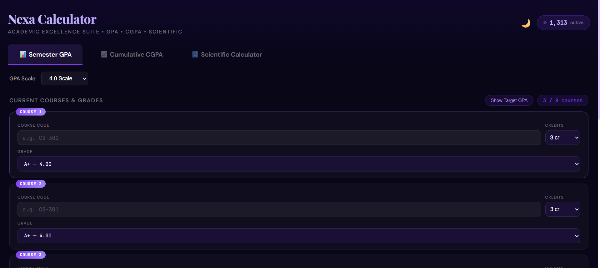
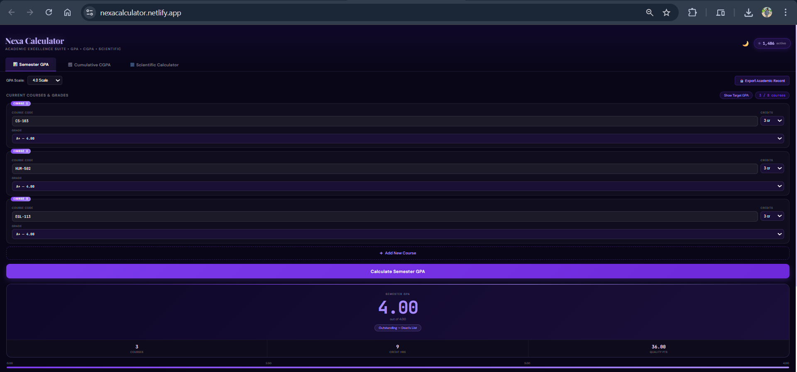
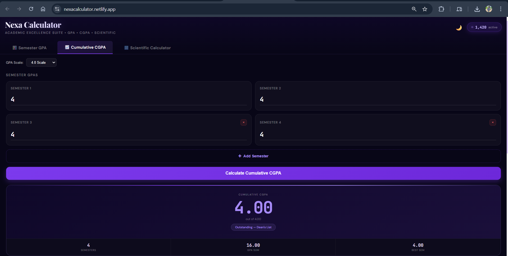
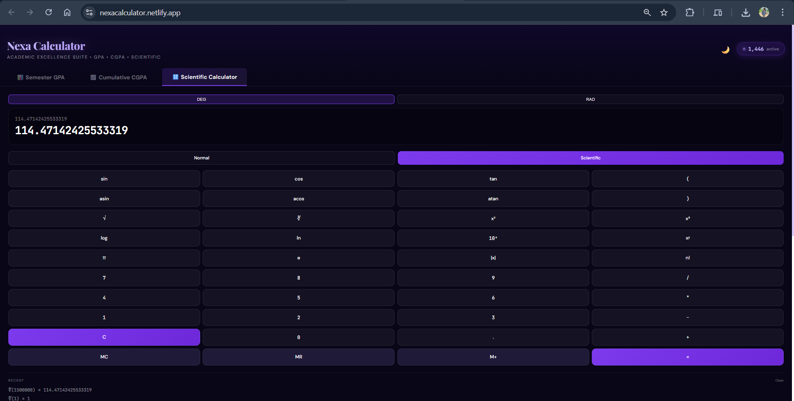

# 🎓 Nexa Calculator | GPA, CGPA & Scientific Calculator

<div align="center">
  
  
  
  
  
</div>

<div align="center">
  
  
  
</div>

<br />

<div align="center">
  <h3>
    <a href="#-live-demo">🚀 Live Demo</a>
    <span> • </span>
    <a href="#-features">✨ Features</a>
    <span> • </span>
    <a href="#-installation">📦 Installation</a>
    <span> • </span>
    <a href="#-usage">📖 Usage</a>
    <span> • </span>
    <a href="#-contributing">🤝 Contributing</a>
  </h3>
</div>

<br />

<p align="center">
  
</p>

---

## 📋 Overview

**Nexa Calculator** is a sophisticated, all-in-one academic calculator built with React and Vite. It empowers students to calculate semester GPA, cumulative CGPA, and perform advanced scientific calculations. Featuring an elegant dark/light theme with real-time grade tracking, academic standing evaluation, PDF export capabilities, and seamless user experience.

### 🎯 Key Highlights

- **3-in-1 Academic Tool**: GPA Calculator, CGPA Calculator, and Scientific Calculator in one application
- **Multiple GPA Scales**: Support for 4.0, 5.0, and 10.0 grading scales
- **Professional UI/UX**: Modern design with dark/light mode toggle and smooth animations
- **Mobile-First Design**: Fully responsive across all devices and screen sizes
- **Real-time Calculations**: Instant feedback with animated numerical displays
- **Academic Insights**: Automatic standing evaluation (Dean's List, Probation, etc.)
- **Export Functionality**: Download academic records as PDF or CSV
- **Contact Integration**: Built-in contact form with EmailJS for user communication
- **SEO Optimized**: Comprehensive meta tags and structured data for search engines

---

## ✨ Features

### 📊 Semester GPA Calculator

<table>
  <tr>
    <td width="50%">
      <ul>
        <li>✅ Support for up to <strong>8 courses</strong> per semester</li>
        <li>✅ Multiple grading scales: <strong>4.0, 5.0, and 10.0</strong></li>
        <li>✅ <strong>Credit hour</strong> selection (1-6 credits)</li>
        <li>✅ <strong>Course code</strong> input for easy identification</li>
        <li>✅ <strong>Quality points</strong> automatic calculation</li>
        <li>✅ <strong>Animated GPA display</strong> with smooth transitions</li>
        <li>✅ <strong>Target GPA Calculator</strong> - Plan your academic goals</li>
      </ul>
    </td>
    <td width="50%">
      <ul>
        <li>✅ <strong>Academic standing</strong> evaluation:
          <ul>
            <li>🏆 Outstanding — Dean's List (92.5%+)</li>
            <li>⭐ Very Good Standing (75%+)</li>
            <li>👍 Good Standing (62.5%+)</li>
            <li>📊 Satisfactory (50%+)</li>
            <li>⚠️ Below Average (25%+)</li>
            <li>🚫 Academic Probation (<25%)</li>
          </ul>
        </li>
        <li>✅ <strong>Visual progress bar</strong> showing GPA performance</li>
        <li>✅ Dynamic course addition/removal</li>
        <li>✅ <strong>Export academic record</strong> as PDF or CSV</li>
      </ul>
    </td>
  </tr>
</table>

### 📈 Cumulative CGPA Calculator

<table>
  <tr>
    <td width="50%">
      <ul>
        <li>✅ Support for up to <strong>8 semesters</strong></li>
        <li>✅ Individual semester GPA input</li>
        <li>✅ <strong>Automatic CGPA calculation</strong></li>
        <li>✅ <strong>Best semester tracking</strong></li>
        <li>✅ Multiple scale support (4.0, 5.0, 10.0)</li>
      </ul>
    </td>
    <td width="50%">
      <ul>
        <li>✅ <strong>Total GPA sum</strong> display</li>
        <li>✅ Real-time validation for input values</li>
        <li>✅ Comprehensive academic summary</li>
        <li>✅ Same academic standing evaluation as GPA</li>
        <li>✅ Interactive semester management</li>
      </ul>
    </td>
  </tr>
</table>

### 🧮 Scientific Calculator

<table>
  <tr>
    <td width="33%">
      <h4>📟 Normal Mode</h4>
      <ul>
        <li>➕ Addition & Subtraction</li>
        <li>✖️ Multiplication & Division</li>
        <li>📊 Percentage calculations</li>
        <li>🔢 Decimal support</li>
        <li>💾 Memory functions (MC, MR, M+, M-)</li>
        <li>📋 Calculation history</li>
      </ul>
    </td>
    <td width="33%">
      <h4>🔬 Scientific Mode</h4>
      <ul>
        <li>📐 sin, cos, tan (DEG/RAD)</li>
        <li>📐 asin, acos, atan</li>
        <li>√ Square root & ∛ Cube root</li>
        <li>x² Square & x³ Cube</li>
        <li>📊 log, ln, 10ˣ</li>
        <li>π Pi & e constants</li>
      </ul>
    </td>
    <td width="34%">
      <h4>📝 Advanced Features</h4>
      <ul>
        <li>|x| Absolute value</li>
        <li>n! Factorial</li>
        <li>1/x Reciprocal</li>
        <li>± Sign toggle</li>
        <li>⌫ Backspace support</li>
        <li>🔄 Clear function</li>
        <li>🎨 Themed interface</li>
      </ul>
    </td>
  </tr>
</table>

### 📧 Contact System

- **EmailJS Integration**: Direct messaging to administrator
- **Form Validation**: Required field checking and email format validation
- **Success Feedback**: Confirmation message with re-send option
- **Error Handling**: User-friendly error messages
- **Loading States**: Visual feedback during submission
- **Responsive Design**: Optimized for all screen sizes

### 🎨 UI/UX Excellence

| Feature | Description |
|---------|-------------|
| 🌓 **Dark/Light Mode** | Toggle between dark and light themes (saved to localStorage) |
| ✨ **Animations** | Smooth transitions, fade effects, and slide animations |
| 📱 **Responsive** | Mobile-first design that adapts to any screen |
| 🎯 **Interactive** | Hover effects, focus states, and visual feedback |
| 📊 **Visitor Counter** | Simulated real-time visitor count |
| 🔢 **Animated Numbers** | Smooth counting animations for results |
| 📑 **Tab Navigation** | Intuitive switching between calculator modes |
| 📥 **Export Modal** | Professional export interface with student details |

---

## 🚀 Live Demo

Experience the application live: **[Nexa Calculator](https://nexacalculator.netlify.app/)**

### Quick Preview

| GPA Calculator | CGPA Calculator | Scientific Calculator |
|:---:|:---:|:---:|
|  |  |  |

---

## 🛠️ Technology Stack

<details>
<summary><strong>Click to expand</strong></summary>

### Core Technologies

| Technology | Version | Purpose |
|------------|---------|---------|
| **React** | 18.3.1 | Frontend UI framework |
| **Vite** | 6.0.1 | Build tool and development server |
| **JavaScript** | ES6+ | Programming language |
| **EmailJS** | 4.4.1 | Email service integration |
| **jsPDF** | 2.5.2 | PDF generation for exports |

### UI & Styling

| Technology | Purpose |
|------------|---------|
| **Inline CSS** | Component-specific styling |
| **Google Fonts** | Typography (DM Sans, Playfair Display, JetBrains Mono) |
| **CSS Animations** | Keyframe animations for UI effects |
| **CSS Grid/Flexbox** | Responsive layout system |

### Development Tools

| Tool | Purpose |
|------|---------|
| **@vitejs/plugin-react** | React support for Vite |
| **vite-plugin-compression** | Gzip/Brotli compression for production |
| **Terser** | JavaScript minification |

### Deployment Platforms

| Platform | Status |
|----------|--------|
| **Netlify** | ✅ Deployed |
| **Vercel** | ✅ Compatible |
| **GitHub Pages** | ✅ Compatible |
| **Any Static Host** | ✅ Compatible |

</details>

---

**🔮 Roadmap & Future Enhancements**

**v2.1.0 (Coming Soon)**

PWA implementation for offline use

Save calculations to localStorage

Keyboard shortcuts for calculator

More export format options

---

**v2.2.0 (Planned)**

Multiple grading system presets

Course weightage customization

Grade prediction calculator

Semester-by-semester graph visualization

Cumulative statistics dashboard

---

**v2.3.0 (Future)**

User accounts and cloud sync

Multi-language support (i18n)

University API integrations

Advanced statistics and analytics

---

**Long-term Vision**

Mobile app (React Native)

Desktop application (Electron)

Browser extension

Academic planning tools

Study schedule integration

---

**👨‍💻 Author**

<div align="center">  <h3>Usman Murtaza</h3> </div><div align="center"> <a href="https://github.com/usmannmurtazaa">  </a> <a href="https://linkedin.com/in/usman-murtaza">  </a> <a href="https://usmanmurtaza.netlify.app">  </a> <a href="mailto:usmanmurtaza@example.com">  </a> </div>

---

**📄 License**

This project is licensed under the MIT License - see the LICENSE file for details.

MIT License

Copyright (c) 2026 Usman Murtaza

Permission is hereby granted, free of charge, to any person obtaining a copy
of this software and associated documentation files (the "Software"), to deal
in the Software without restriction, including without limitation the rights
to use, copy, modify, merge, publish, distribute, sublicense, and/or sell
copies of the Software, and to permit persons to whom the Software is
furnished to do so, subject to the following conditions...

---

**🙏 Acknowledgments**

1. Google Fonts for typography

2. EmailJS for email integration

3. jsPDF for PDF generation

4. Vite Team for the amazing build tool

5. React Community for inspiration and support

---

**📊 Project Stats**

<div align="center">     </div>

---

**⭐ Support**

If you find this project helpful, please consider:

⭐ Starring the repository

🐛 Reporting bugs

💡 Suggesting new features

📢 Sharing with others

<div align="center"> <h3>Made with ❤️ by Usman Murtaza</h3> <p>© 2026 Nexa Calculator. All rights reserved.</p> </div> ```

---

## 📦 Installation

### Prerequisites

- **Node.js** (v18.0.0 or higher)
- **npm** (v8.0.0 or higher) or **yarn** (v1.22.0 or higher)
- **Git** (for cloning the repository)

### Step-by-Step Setup

#### 1️⃣ Clone the Repository

```bash
git clone https://github.com/usmannmurtazaa/NexaCalculator.git
cd NexaCalculator