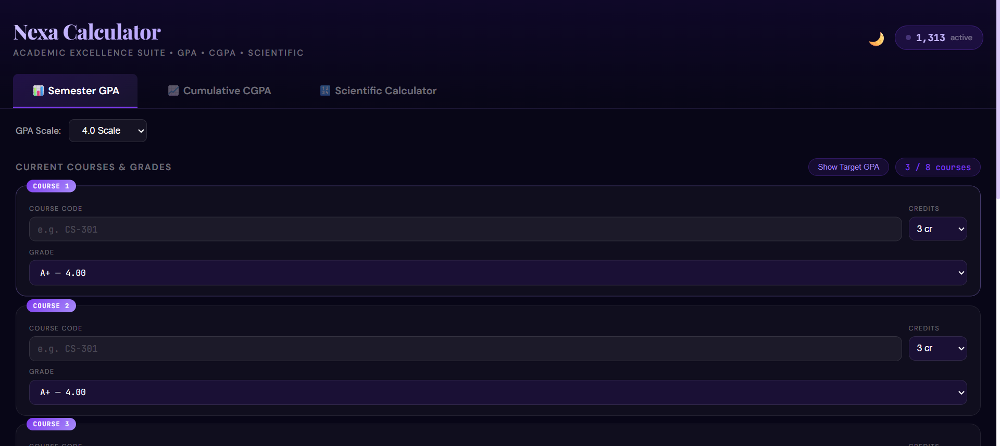

# 🎓 Nexa Calculator | GPA, CGPA & Scientific Calculator

<div align="center">
  
  
  
  
  
  
</div>

<div align="center">
  
  
  
</div>

<br />

<div align="center">
  <h3>
    <a href="#-live-demo">🚀 Live Demo</a>
    <span> • </span>
    <a href="#-features">✨ Features</a>
    <span> • </span>
    <a href="#-installation">📦 Installation</a>
    <span> • </span>
    <a href="#-usage">📖 Usage</a>
    <span> • </span>
    <a href="#-contributing">🤝 Contributing</a>
  </h3>
</div>

<br />

<p align="center">
  
</p>

---

## 📋 Overview

**Nexa Calculator** is a production‑ready, all‑in‑one academic calculator built with React + Vite and powered by Firebase analytics. It delivers a premium SaaS experience with glassmorphism UI, smooth animations, and full mobile responsiveness. Students can calculate semester GPA, cumulative CGPA, and perform advanced scientific calculations, while every interaction is tracked for insights.

### 🎯 Key Highlights

- **3‑in‑1 Academic Tool** – GPA, CGPA, and Scientific Calculator in one polished interface
- **Multiple GPA Scales** – 4.0, 5.0, and 10.0 grading systems supported
- **Premium UI/UX** – Glassmorphism, modern gradients, dark/light mode, fluid animations
- **Mobile‑First** – Fully responsive across all devices and screen sizes
- **Real‑time Feedback** – Animated numerical counters and progress bars
- **Academic Insights** – Automatic standing evaluation (Dean’s List, Probation, etc.)
- **Professional Exports** – PDF & CSV with Firebase activity tracking
- **Firebase Integration** – Analytics, visitor metrics, export tracking, device/browser logging
- **Contact System** – EmailJS‑powered form with validation and success states
- **SEO Optimized** – Structured data, meta tags, and canonical URLs

---

## ✨ Features

### 📊 Semester GPA Calculator

- Up to **8 courses** per semester
- Credit hour selection (1‑6 credits)
- Course code input for identification
- Quality points auto‑computed
- Animated GPA display with smooth transitions
- **Target GPA Calculator** – Plan your academic goals
- **Academic standing** evaluation:
  - 🏆 Outstanding — Dean’s List (92.5%+)
  - ⭐ Very Good Standing (75%+)
  - 👍 Good Standing (62.5%+)
  - 📊 Satisfactory (50%+)
  - ⚠️ Below Average (25%+)
  - 🚫 Academic Probation (<25%)
- Visual progress bar with color feedback
- Export to **PDF / CSV** with Firebase tracking

### 📈 Cumulative CGPA Calculator

- Up to **8 semesters** of GPA values
- Automatic CGPA calculation
- Best semester tracking
- Total GPA sum display
- Real‑time input validation
- Same academic standing evaluation
- Export with full student metadata

### 🧮 Scientific Calculator

- Normal mode: basic arithmetic, memory functions (MC, MR, M+, M‑), percentage
- Scientific mode: sin, cos, tan (deg/rad), inverse trig, sqrt, cbrt, powers, log, ln, π, e, absolute value, factorial, reciprocal, sign toggle
- Calculation history with clear option
- Glassmorphism‑styled button grid

### 🎨 Premium UI/UX

- Dark/Light mode (persisted in localStorage)
- Glassmorphism cards, buttons, inputs, modals
- Smooth CSS animations (fade, slide, scale, shimmer)
- Interactive hover states and focus indicators
- Accessibility: ARIA roles, screen‑reader support, keyboard navigation
- Responsive grids and clamp‑based typography
- Professional loading skeletons and spinners

### 🔥 Firebase Integration

- **Analytics** – Track page loads, tab switches, GPA/CGPA calculations, dark mode toggles, exports
- **Firestore** – Ready for storing export records (scalable schema)
- **Export Tracker** – Logs student name, ID, university, semester, GPA, credits, date, export type, timestamp, device info
- **Visitor Analytics** – Simulates active users with milestone events
- All Firebase functions are modular, async, and error‑handled

### 📧 Contact System

- EmailJS for direct messaging (kept only for contact form)
- Required field validation and email format check
- Success confirmation with “Send Another Message” button
- Loading spinner on submit
- Firebase logs contact form submissions

---

## 🚀 Live Demo

**[https://nexacalculator.netlify.app/](https://nexacalculator.netlify.app/)**

---

## 🛠️ Technology Stack

| Technology | Purpose |
|------------|---------|
| **React 18** | UI library |
| **Vite 8** | Build tool and dev server |
| **JavaScript ES6+** | Language |
| **Firebase 12** | Analytics, Firestore, export tracking |
| **EmailJS** | Contact form emails |
| **jsPDF** | PDF export (dynamic import for code splitting) |
| **Google Fonts** | DM Sans, Playfair Display, JetBrains Mono |
| **CSS Animations** | Custom keyframes and transitions |

---

## 📦 Installation

### Prerequisites

- Node.js ≥ 18
- npm or yarn
- A Firebase project (optional for analytics; the app works without it)

### 1. Clone the repository

```bash
git clone https://github.com/usmannmurtazaa/NexaCalculator.git
cd NexaCalculator
```

### 2. Install dependencies

```bash
npm install
```

### 3. Firebase configuration (optional but recommended)

Create a Firebase project at [console.firebase.google.com](https://console.firebase.google.com) and enable **Analytics** and **Firestore** (if desired).

Create `src/firebase/firebase.js` with your config:

```js
import { initializeApp } from 'firebase/app';
import { getAnalytics } from 'firebase/analytics';
import { getFirestore } from 'firebase/firestore';

const firebaseConfig = {
  apiKey: "YOUR_API_KEY",
  authDomain: "YOUR_PROJECT.firebaseapp.com",
  projectId: "YOUR_PROJECT_ID",
  storageBucket: "YOUR_PROJECT.appspot.com",
  messagingSenderId: "...",
  appId: "...",
  measurementId: "G-..."
};

const app = initializeApp(firebaseConfig);
export const analytics = getAnalytics(app);
export const firestore = getFirestore(app);
export default app;
```

The app will still work without Firebase; analytics calls are safely wrapped.

### 4. EmailJS setup

Create a `.env` file in the project root:

```env
VITE_EMAILJS_SERVICE_ID=your_service_id
VITE_EMAILJS_TEMPLATE_ID=your_template_id
VITE_EMAILJS_PUBLIC_KEY=your_public_key
```

### 5. Start development server

```bash
npm run dev
```

---

## 📖 Usage

1. **Choose a tab** – GPA, CGPA, or Scientific Calculator.
2. **Select your scale** – 4.0, 5.0, or 10.0.
3. **Add courses / semesters** – Fill in details and calculate.
4. **View results** – GPA with standing, progress bar, target GPA calculator.
5. **Export** – Click “Export Academic Record” to save as PDF or CSV (data logged to Firebase).
6. **Contact** – Use the contact form to send feedback.

---

## 🧱 Project Structure

```
src/
├── App.jsx
├── main.jsx
├── constants/
│   ├── grades.js
│   ├── limits.js
│   └── theme.js
├── hooks/
│   ├── useGPA.js
│   ├── useCGPA.js
│   ├── useContactForm.js
│   ├── useVisitors.js
│   └── useDarkMode.js
├── utils/
│   ├── gpa.js
│   ├── pdfExport.js
│   └── csvExport.js
├── firebase/
│   ├── firebase.js
│   ├── analytics.js
│   └── exportTracker.js
├── components/
│   ├── Header.jsx
│   ├── Navigation.jsx
│   ├── GPACalculator.jsx
│   ├── CGPACalculator.jsx
│   ├── CalculatorPanel.jsx
│   ├── ContactSection.jsx
│   ├── Footer.jsx
│   ├── LoadingSpinner.jsx
│   ├── CourseCard.jsx
│   ├── ResultCard.jsx
│   ├── CGPAResultCard.jsx
│   ├── GradeExtras.jsx   (ProgressBar + TargetGPACalculator)
│   ├── ExportModal.jsx
│   └── AnimatedNumber.jsx
└── styles/
    └── global.css
```

---

## 🔮 Roadmap

- **PWA** – Installable offline app
- **LocalStorage history** – Save past calculations
- **User accounts** – Cloud sync (Firebase Auth)
- **Graphs** – GPA trends across semesters
- **i18n** – Multi‑language support

---

## 👨‍💻 Author

**Usman Murtaza**

[](https://github.com/usmannmurtazaa)
[](https://usmanmurtaza.netlify.app)
[](mailto:usmanmurtaza@example.com)

---

## 📄 License

MIT License – see the [LICENSE](LICENSE) file for details.

---

## ⭐ Support

If you find this project helpful, please consider starring the repository, reporting bugs, or sharing it with others. Contributions are welcome!
```